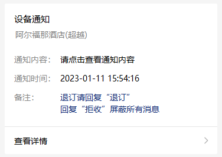
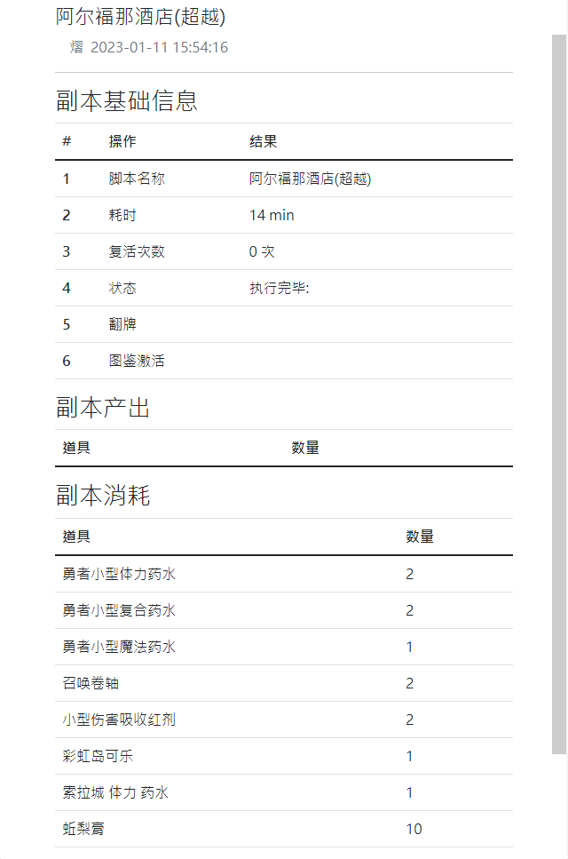

# XC 自动推播插件

## 使用方式

1. 登录 [PushPlus推送加](http://www.pushplus.plus/push1.html)
2. 获取 `token`

### config.yml 详解
```yaml
token: #PushPlus的Token
path: #XC的AutoLog地址,需要绝对路径,【Ex:C:\SXC\Data\AutoLog\C4E3B0D4C0B4BFA9】

ignore: # 填写不想要提醒的副本名称 
  - 副本名称1
  - 副本名称2
```

## 效果展示
- 粗略图<br/>
  
- 详细图<br/>
  


